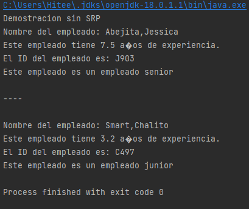
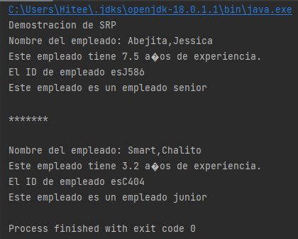
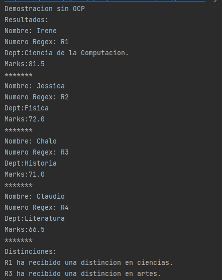
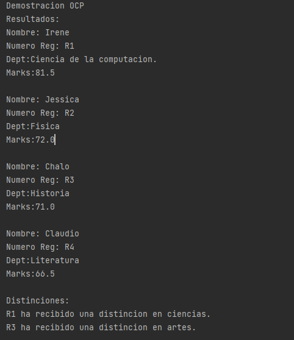
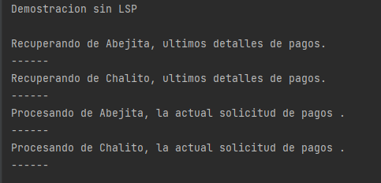
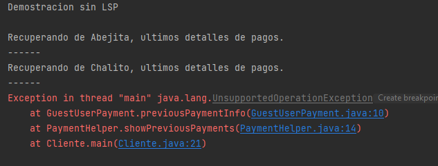

# PC3 DESARROLO DE SOFTWARE

## Principio de responsabilidad única (SRP)
### Pregunta 1

Figura 1 :  Salida de la ejecución del método main de la clase Cliente

La Figura 1 muestra la ejecución del método main de la clase Cliente 
(src/main/java/NoSolid/SRP/Cliente.java). En donde primero se imprime 
"Demostración sin SRP" y luego se muestra el nombre, los años de experiencia,
el ID y la categoría de dos empleados Jessica y Chalito. 

Si comparamos estos resultados con el código del método main de la clase Cliente
notamos que primero se tiene una instrucción de impresión para "Demostración sin SRP",
luego se crea un objeto Empleado (Jessica) enviando sus atributos en el constructor de la clase
Empleado y posteriormente se llama al método privado de Cliente (_showEmpDetail_) 
que recibe como parámetro un objeto Empleado (Jessica).
Este método imprime los detalles (nombre, años de experiencia, ID, categoría) del objeto 
empleado brindado (Jessica) usando los métodos de la clase Empleado _displayEmpDetail_, _generateEmpId_
y _checkSeniority_.

Lo mismo se repite para el siguiente empleado Chalito.

### Pregunta 2
El problema de diseño se centra en la clase _Empleado_, ya que 
si vemos el código de esta clase notamos que tiene más de una 
responsabilidad, además de otorgar la información básica del empleado 
(_displayEmpDetail_), también se encarga de generar los IDs (_generateEmpId_)
de manera aleatoria de cada empleado y de categorizar a los empleados 
(_checkSeniority_) con base en los años de experiencia  del empleado. 

Esto hace que tenga más de una responsabilidad como clase y la razón 
es que se ha juntado todos los métodos en una sola clase, lo que
aparenta dar más cohesión al código, pero no toma en cuenta que 
el código puede tener cambios, como el de redefinir la manera en que
se obtiene los ID's de los empleados en _generateEmpId_ ya que la manera
como está definido se pueden dar casos que se tengan empleados con el 
mismo ID, algo que no debería ocurrir.

### Pregunta 3

Client.java
~~~
public class Cliente {
    public static void main(String[] args) {
        System.out.println("Demostracion de SRP");

        Empleado jessica = new Empleado("Jessica", "Abejita", 7.5);
        showEmpDetail(jessica);

        System.out.println("\n*******\n");

        Empleado chalo = new Empleado ("Chalito", "Smart", 3.2);
        showEmpDetail(chalo);
    }

    private static void showEmpDetail(Empleado emp) {

        emp.displayEmpDetail();

        String empId = new GeneradorIDEmpleado().generateEmpId(emp.firstName);
        System.out.println("El ID de empleado es" + empId);

        String rank = new SeniorityChecker().checkSeniority(emp.experienceInYears);
        System.out.println("Este empleado es un" + " empleado " + rank);
    }
}
~~~

Empleado.java

~~~
public class Empleado {
    public String firstName, lastName;
    public double experienceInYears;
    public Empleado(String firstName, String lastName, double experience) {
        this.firstName = firstName;
        this.lastName = lastName;
        this.experienceInYears = experience;
    }
    public void displayEmpDetail(){
        System.out.println("Nombre del empleado: "+lastName+","+firstName);
        System.out.println("Este empleado tiene "+ experienceInYears+" años de experiencia.");
    }
}
~~~

SeniorityChecker.java

~~~
public class SeniorityChecker {
    public String checkSeniority(double experienceInYears){
        return experienceInYears > 5 ?"senior":"junior";
    }
}
~~~

GeneradorIDEmpleado.java

~~~
public class GeneradorIDEmpleado {
    public String generateEmpId(String empFirstName) {
        int random = new Random().nextInt(1000);
        String empId = empFirstName.substring(0,1)+random;
        return empId;
    }
}
~~~

### Pregunta 4

Figura 2: Salida de la ejecución del método main de la clase Cliente siguiendo SRP.

En la Figura 2 tenemos una salida similar a la que se obtuvo anteriormente
en la Figura 1 al ejecutar el método main de la clase Cliente (src/main/java/Solid/SRP/Cliente.java)
, pero en este caso se sigue el SRP y es por eso que en la primera línea 
vemos ahora la salida "Demostracion de SRP". El código resultante usando 
el SRP se muestra en la pregunta 3. De los cambios realizados tenemos que:

En la clase _Empleado_ nos quedamos con los atributos: nombre, apellido y años de
experiencia los cuales son definidos con el constructor de la clase, y el método
_displayEmpDetail_ que nos muestra los atributos del empleado de una manera formateada.
Adicional a ello creamos la clase _SeniorityChecker.java_ que contiene solo el método
_checkSeniority_ que pide
como parámetro un valor tipo _double_ que hace referencia a los años de experiencia
del empleado para categorizarlo como junior o senior y devolver la categoría
de empleado. También creamos la clase _GeneradorIDEmpleado.java_ que solo tiene el
método _generateEmpId_ que pide como parámetro una cadena que hace referencia
al primer nombre del empleado y devuelve el ID del empleado.

En el método main de Cliente se crea los objetos jessica y chalo de la clase
_Empleado_, usando el constructor para definir los atributos de los empleados,
luego se llama 2 veces al método privado de Cliente _showEmpDetails_ que tiene como
parámetro a un objeto empleado. En este método se imprime los datos (atributos)
de cada empleado, para ello llama al método _displayEmpDetail_ de la clase _Empleado_
para mostrar el nombre completo y los años de experiencia del empleado, 
después creamos la variable _empId_ que almacenará el ID del empleado y la inicializaremos con el método
_generateEmpId_ de la clase _GeneradorIDEmpleado_ para esto le damos como parámetro el atributo _firstName_
del objeto Empleado e imprimimos la variable _empId_. Finalmente creamos una variable 
_rank_ que almacena la categoría del empleado y lo inicializaremos
con el método _checkSeniority_ de la clase _GeneradorIDEmpleado_ para esto le pasamos 
como parámetro los años de experiencia del empleado (_experienceInYears_) e 
imprimimos la variable _rank_ devuelta por el método.

## Principio abierto/cerrado (OCP)

### Pregunta 5

Como hemos revisado en la anterior sección, no es correcto proceder de esta forma, ya que
estaríamos violando el principio de responsabilidad única (SRP) al asignarle 2 tareas totalmente
distintas a la misma clase. _displayResult_ corresponde a otorgar la información básica del
estudiante mientras que _evaluateDistinction_ se dedica a evaluar si es elegible para un
certificado con base en su desempeño, por lo que estos métodos son totalmente
distintos (tienen baja cohesión) y por lo tanto deberían declararse en 2 clases distintas.

### Pregunta 6

Se ejecuta el método main de la clase Cliente en donde se declara
una lista de objetos de tipo Estudiante y se inicializa con el método
privado enrollStudents de la clase Cliente. Luego se itera entre todos
los estudiantes y se imprime sus datos con detalle. Al final se crea
un objeto de tipo DistinctionDecider, el cual evalúa si un estudiante
recibe una distinción, se itera en la lista y para cada objeto de la lista
se evalúa si el Estudiante recibe una distinción y se imprimen los que
recibieron el certificado.

### Pregunta 7

El diseño del código actual es problemático para la extensión del mismo, podemos
observar que al querer extender el método evaluateDistinction de DistinctionDecider
tendremos que constantemente aumentar la cantidad de ifs dentro del mismo, así
teniendo un código demasiado grande sin necesidad de serlo. Este problema es 
producto de la baja escabilidad que posee nuestro clase DistinctionDecider.

Declarando la clase Estudiante.java como abstracta obtenemos:

~~~
abstract class Estudiante {
    String name;
    String regNumber;
    double score;
    String department;

    public Estudiante(String name, String regNumber, double score) {
        this.name = name;
        this.regNumber = regNumber;
        this.score = score;
    }

    public String toString() {
        return ("Nombre: " + name + "\nNumero Reg: " + regNumber + "\nDept:" + department + "\nMarks:"
                + score + "\n");
    }

}
~~~

ArteEstudiante.java:

~~~
public class ArteEstudiante extends Estudiante{
    public ArteEstudiante(String name, String regNumber, double score, String dept) {
        super(name,regNumber,score);
        this.department = dept;
    }
}
~~~

CienciaEstudiante.java:

~~~
public class CienciaEstudiante extends Estudiante{
    public CienciaEstudiante(String name, String regNumber, double score,String dept) {
        super(name,regNumber,score);
        this.department = dept;
    }
}
~~~

### Pregunta 8

Declarando como interface DistinctionDecider.java:

~~~
interface DistinctionDecider{
    void evaluateDistinction(Estudiante estudiante);
}
~~~

### Pregunta 9

ArtsDistinctionDecider.java

~~~
public class ArtsDistinctionDecider implements DistinctionDecider{
    public void evaluateDistinction(Estudiante estudiante){
        if(estudiante.score > 70){
            System.out.println(estudiante.regNumber + " ha recibido una distincion en artes.");
        }
    }
}
~~~

ScienceDistinctionDecider.java

~~~
public class ScienceDistinctionDecider implements DistinctionDecider {
    public void evaluateDistinction(Estudiante estudiante){
        if(estudiante.score > 80){
            System.out.println(estudiante.regNumber + " ha recibido una distincion en ciencias.");
        }
    }
}
~~~

### Pregunta 10

Se ejecuta el método main en la clase Cliente en donde se crean dos listas, una
de tipo CienciasEstudiantes que alberga a los estudiantes del área de ciencias,
y otra de tipo ArtesEstudiantes que alberga a los estudiantes del área de artes.
Estas 2 listas se inicializan con los métodos privados enrollScienceStudents y
enrollArtsStudents de la clase Cliente. En la siguiente parte, se itera cada lista
respectivamente para poder imprimir sus datos de cada uno. Finalmente, en la
última parte se generan dos objetos, uno de tipo scienceDistinctionDecider para
los estudiantes de ciencias y el otro de tipo artsDistinctionDecider para los
estudiantes de arte, estos dos evalúan para cada tipo de estudiante si recibieron
una distinción por sus notas. Procedemos a iterar las listas para evaluar si se
han recibido afirmativamente o no las distinciones, imprimiendo los que sí
lograron recibirlas, culminando la ejecución del código.

### Pregunta 11

Los beneficios de ahora tener una clase específica para cada área en la que se
desempeñe un estudiante es que ahora podremos distinguirlos a través de las
clases, simplemente heredando la clase principal estudiante mejorando la
escalabilidad del código, ya que cuando por ejemplo necesitemos integrar otra
área más aparte de ciencias o artes simplemente será necesario heredar otra vez
la clase estudiante y definirla para esta nueva área. Así mismo, en el caso de
las distinciones, ahora podemos declarar una evaluación para cada área distinta
sin necesidad de tener que declarar tantos ifs en una misma clase, simplemente
implementaremos la interfaz DistinctionDecider para realizar una nueva evaluación
para esta nueva área.

### Pregunta 12

Observamos que en la clase Cliente se crea un nuevo objeto helper de la clase
PaymentHelper. Posteriormente, se generan dos objetos de la clase RegisteredPayment
para recuperar los datos de los pagos de los usuarios Abejita y Chalito. Primero
se añaden ambos usuarios a los helper para poder recuperar la información. Luego,
llamamos a la función showPreviousPayments del helper para mostrar los últimos pagos
que han tenido los dos usuarios. Por último, llamamos a la función processNewPayments
para imprimir los datos de la actual solicitud de pagos de ambos usuarios.
Terminando así la ejecución del programa.

### Pregunta 13

GuestUserPayment.java

~~~
public class GuestUserPayment implements Payment{
    String name;
    public GuestUserPayment() {
        this.name = "guest";
    }
    @Override
    public void previousPaymentInfo(){
        throw new UnsupportedOperationException();
    }
    @Override
    public void newPayment(){
        System.out.println("Procesando de "+name+ "pago actual request.");
    }
}
~~~

### Pregunta 14

Se lanza una excepción del tipo UnsupportedOperationException generado al querer
llamar al método showPreviousPayments del helper en la clase Cliente, ya que al
hacerlo el helper tiene que llamar a la función previousPaymentInfo que posee el
GuestUser, pero este al ser un usuario invitado no posee ningún pago previo por lo
que se genera la excepción. Vemos que el problema es que esta clase GuestUser no
puede implementar correctamente la función previousPaymentInfo de su interfaz padre
por lo que habrá que transformar esta interfaz si queremos que se pueda hacer uso
de esta clase GuestUser sin generar ninguna excepción.

### Pregunta 15