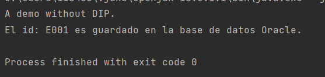

# PC3 DESARROLO DE SOFTWARE

## Principio de responsabilidad única (SRP)
### Pregunta 1

Figura 1 :  Salida de la ejecución del método main de la clase Cliente

La Figura 1 muestra la ejecución del método main de la clase Cliente
(src/main/java/NoSolid/SRP/Cliente.java). En donde primero se imprime
"Demostración sin SRP" y luego se muestra el nombre, los años de experiencia,
el ID y la categoría de dos empleados Jessica y Chalito.

Si comparamos estos resultados con el código del método main de la clase Cliente
notamos que primero se tiene una instrucción de impresión para "Demostración sin SRP",
luego se crea un objeto Empleado (Jessica) enviando sus atributos en el constructor de la clase
Empleado y posteriormente se llama al método privado de Cliente (_showEmpDetail_)
que recibe como parámetro un objeto Empleado (Jessica).
Este método imprime los detalles (nombre, años de experiencia, ID, categoría) del objeto
empleado brindado (Jessica) usando los métodos de la clase Empleado _displayEmpDetail_, _generateEmpId_
y _checkSeniority_.

Lo mismo se repite para el siguiente empleado Chalito.

### Pregunta 2
El problema de diseño se centra en la clase _Empleado_, ya que
si vemos el código de esta clase notamos que tiene más de una
responsabilidad, además de otorgar la información básica del empleado
(_displayEmpDetail_), también se encarga de generar los IDs (_generateEmpId_)
de manera aleatoria de cada empleado y de categorizar a los empleados
(_checkSeniority_) con base en los años de experiencia  del empleado.

Esto hace que tenga más de una responsabilidad como clase y la razón
es que se ha juntado todos los métodos en una sola clase, lo que
aparenta dar más cohesión al código, pero no toma en cuenta que
el código puede tener cambios, como el de redefinir la manera en que
se obtiene los ID's de los empleados en _generateEmpId_ ya que la manera
como está definido se pueden dar casos que se tengan empleados con el
mismo ID, algo que no debería ocurrir.

### Pregunta 3

Client.java
~~~
public class Cliente {
    public static void main(String[] args) {
        System.out.println("Demostracion de SRP");

        Empleado jessica = new Empleado("Jessica", "Abejita", 7.5);
        showEmpDetail(jessica);

        System.out.println("\n*******\n");

        Empleado chalo = new Empleado ("Chalito", "Smart", 3.2);
        showEmpDetail(chalo);
    }

    private static void showEmpDetail(Empleado emp) {

        emp.displayEmpDetail();

        String empId = new GeneradorIDEmpleado().generateEmpId(emp.firstName);
        System.out.println("El ID de empleado es" + empId);

        String rank = new SeniorityChecker().checkSeniority(emp.experienceInYears);
        System.out.println("Este empleado es un" + " empleado " + rank);
    }
}
~~~

Empleado.java

~~~
public class Empleado {
    public String firstName, lastName;
    public double experienceInYears;
    public Empleado(String firstName, String lastName, double experience) {
        this.firstName = firstName;
        this.lastName = lastName;
        this.experienceInYears = experience;
    }
    public void displayEmpDetail(){
        System.out.println("Nombre del empleado: "+lastName+","+firstName);
        System.out.println("Este empleado tiene "+ experienceInYears+" años de experiencia.");
    }
}
~~~

SeniorityChecker.java

~~~
public class SeniorityChecker {
    public String checkSeniority(double experienceInYears){
        return experienceInYears > 5 ?"senior":"junior";
    }
}
~~~

GeneradorIDEmpleado.java

~~~
public class GeneradorIDEmpleado {
    public String generateEmpId(String empFirstName) {
        int random = new Random().nextInt(1000);
        String empId = empFirstName.substring(0,1)+random;
        return empId;
    }
}
~~~

### Pregunta 4

Figura 2: Salida de la ejecución del método main de la clase Cliente siguiendo SRP.

En la Figura 2 tenemos una salida similar a la que se obtuvo anteriormente
en la Figura 1 al ejecutar el método main de la clase Cliente (src/main/java/Solid/SRP/Cliente.java)
, pero en este caso se sigue el SRP y es por eso que en la primera línea
vemos ahora la salida "Demostracion de SRP". El código resultante usando
el SRP se muestra en la pregunta 3. De los cambios realizados tenemos que:

En la clase _Empleado_ nos quedamos con los atributos: nombre, apellido y años de
experiencia los cuales son definidos con el constructor de la clase, y el método
_displayEmpDetail_ que nos muestra los atributos del empleado de una manera formateada.
Adicional a ello creamos la clase _SeniorityChecker.java_ que contiene solo el método
_checkSeniority_ que pide
como parámetro un valor tipo _double_ que hace referencia a los años de experiencia
del empleado para categorizarlo como junior o senior y devolver la categoría
de empleado. También creamos la clase _GeneradorIDEmpleado.java_ que solo tiene el
método _generateEmpId_ que pide como parámetro una cadena que hace referencia
al primer nombre del empleado y devuelve el ID del empleado.

En el método main de Cliente se crea los objetos jessica y chalo de la clase
_Empleado_, usando el constructor para definir los atributos de los empleados,
luego se llama 2 veces al método privado de Cliente _showEmpDetails_ que tiene como
parámetro a un objeto empleado. En este método se imprime los datos (atributos)
de cada empleado, para ello llama al método _displayEmpDetail_ de la clase _Empleado_
para mostrar el nombre completo y los años de experiencia del empleado,
después creamos la variable _empId_ que almacenará el ID del empleado y la inicializaremos con el método
_generateEmpId_ de la clase _GeneradorIDEmpleado_ para esto le damos como parámetro el atributo _firstName_
del objeto Empleado e imprimimos la variable _empId_. Finalmente creamos una variable
_rank_ que almacena la categoría del empleado y lo inicializaremos
con el método _checkSeniority_ de la clase _GeneradorIDEmpleado_ para esto le pasamos
como parámetro los años de experiencia del empleado (_experienceInYears_) e
imprimimos la variable _rank_ devuelta por el método.

## Principio abierto/cerrado (OCP)

### Pregunta 5

Como hemos revisado en la anterior sección, no es correcto proceder de esta forma, ya que
estaríamos violando el principio de responsabilidad única (SRP) al asignarle 2 tareas totalmente
distintas a la misma clase. _displayResult_ corresponde a otorgar la información básica del
estudiante mientras que _evaluateDistinction_ se dedica a evaluar si es elegible para un
certificado con base en su desempeño, por lo que estos métodos son totalmente
distintos (tienen baja cohesión) y por lo tanto deberían declararse en 2 clases distintas.

### Pregunta 6

Figura 3 : Salida del método main de la clase Cliente (src/main/java/NoSolid/OCP/Cliente.java)

En la Figura 3 tenemos la salida al ejecutar el método main de la clase Cliente.
Si comparamos el código de este método con la salida al ejecutarlo vemos que en la
primera línea se tiene una instrucción para imprimir 'Demostración sin OCP', luego
se declara una lista de objetos de tipo _Estudiante_ y se inicializa con el método
privado _enrollStudents_ de la clase _Cliente_ (este método retorna una lista de objetos de la
clase _Estudiante_). Luego se tiene una instrucción para imprimir 'Resultados' y
posteriormente se crea un bucle _for_ que itera entre los elementos de la lista de
estudiantes (_enrolledStudents_), dentro de este bucle _for_ se llama al método _toString_
de la clase _Estudiante_ de manera implícita (un objeto _Estudiante_ dentro de una instrucción
de impresión), este método imprime los atributos de los estudiantes de manera formateada.
En las últimas líneas del método main se tiene una instrucción de impresión para
'Distinciones:' y se crea el objeto _distinctionDecider_ de la clase _DistinctionDecider_,
posteriormente se crea otro bucle _for_ que itera sobre la lista de estudiantes (_enrolledStudents_)
en este caso dentro del bucle _for_ se usa el objeto _distinctionDecider_ para llamar al método
_evaluateDistinction_, este método pide como parámetro un objeto _Estudiante_, que evalua
con la ayuda de los atributos del estudiante si el estudiante recibe una distinción, y solo se imprimen
los que recibieron el certificado.

### Pregunta 7

El diseño del código actual es problemático para la extensión de la clase _Estudiante_,
porque si queremos crear un nuevo departamento como ingeniería, el método _evaluateDistinction_
de _DistinctionDecider_ se tendría que modificar y aumentar la cantidad de ifs dentro del mismo,
teniendo un código demasiado grande sin necesidad de serlo. Este problema es
producto de la baja escalabilidad que posee nuestra clase _DistinctionDecider_.

Redefinimos la clase _Estudiante_ y creamos las subclases _ArteEstudiante_ y _CienciaEstudiante_:

Estudiante.java
~~~
abstract class Estudiante {
    String name;
    String regNumber;
    double score;
    String department;

    public Estudiante(String name, String regNumber, double score) {
        this.name = name;
        this.regNumber = regNumber;
        this.score = score;
    }

    public String toString() {
        return ("Nombre: " + name + "\nNumero Reg: " + regNumber + "\nDept:" + department + "\nMarks:"
                + score + "\n");
    }

}
~~~

ArteEstudiante.java:

~~~
public class ArteEstudiante extends Estudiante{
    public ArteEstudiante(String name, String regNumber, double score, String dept) {
        super(name,regNumber,score);
        this.department = dept;
    }
}
~~~

CienciaEstudiante.java:

~~~
public class CienciaEstudiante extends Estudiante{
    public CienciaEstudiante(String name, String regNumber, double score,String dept) {
        super(name,regNumber,score);
        this.department = dept;
    }
}
~~~

### Pregunta 8

Declarando como interfaz DistinctionDecider.java:

~~~
interface DistinctionDecider{
    public void evaluateDistinction(Estudiante estudiante);
}
~~~

### Pregunta 9

ArtsDistinctionDecider.java

~~~
public class ArtsDistinctionDecider implements DistinctionDecider{
    public void evaluateDistinction(Estudiante estudiante){
        if(estudiante.score > 70){
            System.out.println(estudiante.regNumber + " ha recibido una distincion en artes.");
        }
    }
}
~~~

ScienceDistinctionDecider.java

~~~
public class ScienceDistinctionDecider implements DistinctionDecider {
    public void evaluateDistinction(Estudiante estudiante){
        if(estudiante.score > 80){
            System.out.println(estudiante.regNumber + " ha recibido una distincion en ciencias.");
        }
    }
}
~~~

### Pregunta 10

Figura4 : Salida al ejecutar el método main de la clase Cliente (src/main/java/Solid/OCP/Cliente.java)

En la Figura 4 tenemos el resultado al ejecutar el método main en la clase Cliente,
este resultado es similar al resultado sin usar el OCP de la Figura 3.
Comparando la salida con el código del método vemos que en la primera línea se
imprime 'Demostracion OCP', luego se crean dos listas, una
de tipo _CienciasEstudiantes_ que alberga a los estudiantes del área de ciencias,
y otra de tipo _ArtesEstudiantes_ que alberga a los estudiantes del área de artes.
Estas 2 listas se inicializan con los métodos privados _enrollScienceStudents_ y
_enrollArtsStudents_ de la clase Cliente. En la siguiente parte, se itera cada lista
con un bucle _for_ para poder imprimir los datos de cada estudiante. Finalmente, en la
última parte se generan dos objetos, uno de tipo _scienceDistinctionDecider_ para
los estudiantes de ciencias y el otro de tipo _artsDistinctionDecider_ para los
estudiantes de arte, estos dos objetos llaman al método _evaluateDistinction_ (que pide como
parámetro un objeto _Estudiante_) para evaluar a cada estudiante si reciben
una distinción por sus notas. Procedemos a iterar las listas con un bucle _for_ para evaluar si se
han recibido afirmativamente o no las distinciones, imprimiendo los que sí
lograron recibirlas, culminando la ejecución del código.

### Pregunta 11

Los beneficios de ahora tener una clase específica para cada área en la que se
desempeñe un estudiante es que ahora podremos distinguirlos a través de las
clases, simplemente heredando la clase principal estudiante mejorando la
escalabilidad del código, ya que cuando por ejemplo necesitemos integrar otra
área más aparte de ciencias o artes simplemente será necesario heredar otra vez
la clase estudiante y definirla para esta nueva área. Así mismo, en el caso de
las distinciones, ahora podemos declarar una evaluación para cada área distinta
sin necesidad de tener que declarar tantos ifs en una misma clase, simplemente
implementaremos la interfaz DistinctionDecider para realizar una nueva evaluación
para esta nueva área.

## Principio de sustitución de Liskov (LSP)

### Pregunta 12

Observamos que en la clase Cliente se crea un nuevo objeto helper de la clase
PaymentHelper. Posteriormente, se generan dos objetos de la clase RegisteredPayment
para recuperar los datos de los pagos de los usuarios Abejita y Chalito. Primero
se añaden ambos usuarios a los helper para poder recuperar la información. Luego,
llamamos a la función showPreviousPayments del helper para mostrar los últimos pagos
que han tenido los dos usuarios. Por último, llamamos a la función processNewPayments
para imprimir los datos de la actual solicitud de pagos de ambos usuarios.
Terminando así la ejecución del programa.

### Pregunta 13

GuestUserPayment.java

~~~
public class GuestUserPayment implements Payment{
    String name;
    public GuestUserPayment() {
        this.name = "guest";
    }
    @Override
    public void previousPaymentInfo(){
        throw new UnsupportedOperationException();
    }
    @Override
    public void newPayment(){
        System.out.println("Procesando de "+name+ "pago actual request.");
    }
}
~~~

### Pregunta 14

Se lanza una excepción del tipo UnsupportedOperationException generado al querer
llamar al método showPreviousPayments del helper en la clase Cliente, ya que al
hacerlo el helper tiene que llamar a la función previousPaymentInfo que posee el
GuestUser, pero este al ser un usuario invitado no posee ningún pago previo por lo
que se genera la excepción. Vemos que el problema es que esta clase GuestUser no
puede implementar correctamente la función previousPaymentInfo de su interfaz padre
por lo que habrá que transformar esta interfaz si queremos que se pueda hacer uso
de esta clase GuestUser sin generar ninguna excepción.

### Pregunta 15

### Pregunta 16

NewPayment.java
~~~
interface NewPayment {
   void newPayment();
}
~~~

PreviousPayment.java
~~~
interface PreviousPayment {
  void previousPaymentInfo();
}
~~~

RegisteredUserPayment.java
~~~
public class RegisteredUserPayment implements NewPayment,PreviousPayment {
    String name;
    public RegisteredUserPayment(String userName){
        this.name = userName;
    }
    @Override
    public void previousPaymentInfo(){
        System.out.println("Recuperando de "+ name+ ", ultimos detalles de pagos.");
    }
    @Override
    public void newPayment(){
        System.out.println("Procesando de "+name+", la actual solicitud de pagos .");
    }
}
~~~

GuestUserPayment.java
~~~
public class GuestUserPayment implements NewPayment{
    String name;
    public GuestUserPayment(){
        this.name = "guest";
    }
    @Override
    public void newPayment(){
        System.out.println("Procesando de "+name+ "pago actual request.");
    }
}
~~~

### Pregunta 17

Los cambios claves son separar la interfaz Payment en 2 NewPayment y PreviousPayment para que
la clase concreta GuestUserPayment solo tenga que implementar a NewPayment y no se vea obligado
a utilizar el método de la interfaz PreviousPayment, ya que no es parte de su naturaleza.

### Pregunta 18

Refactorizando la clase PaymentHelper

~~~
import java.util.ArrayList;
import java.util.List;

public class PaymentHelper {
    List<PreviousPayment> previouspayments = new ArrayList<>();
    List<NewPayment> newpayments = new ArrayList<>();
    public void addPreviousPayment(PreviousPayment user){
        previouspayments.add(user);
    }
    public void addNewPayment(NewPayment user){
        newpayments.add(user);
    }
    public void showPreviousPayments(){
        for(PreviousPayment previouspayment: previouspayments){
            previouspayment.previousPaymentInfo();
            System.out.println("------");
        }
    }
    public void processNewPayments(){
        for(NewPayment newpayment: newpayments){
            newpayment.newPayment();
            System.out.println("------");
        }
    }
}
~~~

## Principio de segregación de interfaz (ISP)

### Pregunta 19

Mientras desarrollemos una aplicación vamos a tener que modificar la clase base o interfaz para satisfacer los requisitos
de los nuevos clientes que se vayan presentando.

### Pregunta 20

En este escenario tenemos la interfaz impresora que contiene 2 métodos y sus clases concretas que son ImpresoraAvanzada e
ImpresoraBasica solo la primera usa ambos métodos entonces al modificar un método dentro de la clase ImpresoraAvanzada
también tendremos que hacerlo en su interfaz hasta aquí todo bien, pero el problema viene cuando los cambios en la interfaz
afecte el funcionamiento de la ImpresoraBasica.

### Pregunta 21

Una explicación de lo anterior sería el problema de que una interfaz contenga métodos que algunas clases no utilicen es
que los cambios de estos métodos, en las clases que sí los hacen, afecta a las clases que no.

### Pregunta 22

No, porque una de sus clases concretas no utiliza el método sendFax() debido a que no está en su naturaleza.

### Pregunta 23

¿Qué código puedes escribir?,

~~~
interface Impresora {
    void printDocument();
    void sendFax();
}
~~~

~~~
public class ImpresoraAvanzada implements Impresora{
    @Override
    public void printDocument() {
        System.out.println("La impresora avanzada imprime un documento.");
    }

    @Override
    public void sendFax() {
        System.out.println("La impresora avanzada envía un fax.");
    }
}
~~~

### Pregunta 24

~~~
 import java.util.ArrayList;
 import java.util.List;

class Cliente {
    public static void main(String[] args) {
        System.out.println("Demostracion sin ISP");
        Impresora impresora = new ImpresoraAvanzada();
        impresora.printDocument();
        impresora.sendFax();

        impresora = new ImpresoraBasica();
        impresora.printDocument();
A        //impresora.sendFax(); Error de tiempo de ejecucion

        List<Impresora> impresoras = new ArrayList<Impresora>();
        impresoras.add(new ImpresoraAvanzada());
        impresoras.add(new ImpresoraBasica());
        for(Impresora dispositivo:impresoras){
            dispositivo.printDocument();
B            //dispositivo.sendFax(); Error de tiempo de ejecucion
        }
    }
}
~~~

En las líneas A y B hay error de tiempo de ejecución

### Pregunta 25
~~~
impresoras.forEach( (dispositivo) -> {dispositivo.printDocument();} );
~~~

### Pregunta 26

En la línea 9, crea un objeto de tipo ImpresoraAvanzada y llama a sus métodos printDocument() y sendFax().
Luego, en la línea 13 ahora la variable impresora representa un objeto de tipo ImpresoraBasica y llamamos al método
printDocument en la línea 14.

Después creamos una lista de interfaces Impresora y añadimos 2 objetos que la implementan ImpresoraAvanzada e
ImpresoraBasica y mediante un for iteramos en esta lista de interfaces mientras llamamos al método printDocument
para cada objeto de la lista.

Al final hacemos lo mismo que antes pero ahora con una expresión lambda

### Pregunta 27

Sean los siguientes archivos:

Impresora.java
~~~
interface Impresora {
    void printDocument();
}
~~~

DispositivoFax.java
~~~
interface DispositivoFax {
   void sendFax();
}
~~~

ImpresoraAvanzada.java
~~~
public class ImpresoraAvanzada implements Impresora, DispositivoFax{
    @Override
    public void printDocument(){
        System.out.println("La impresora avanzada imprime un documento.");
    }
    @Override
    public void sendFax() {
        System.out.println("La impresora avanzada envía un fax.");
    }
}
~~~

ImpresoraBasica
~~~
public class ImpresoraBasica implements Impresora{
    @Override
    public void printDocument() {
        System.out.println("La impresora avanzada imprime un documento.");
    }
}
~~~

Cliente.java
~~~
public class Cliente {
    public static void main(String[] args) {
        System.out.println("Demostracion ISP");

        Impresora impresora = new ImpresoraBasica();
        impresora.printDocument();
        impresora = new ImpresoraAvanzada();
        impresora.printDocument();

        DispositivoFax fax = new ImpresoraAvanzada();
        fax.sendFax();
    }
}
~~~

Y el resultado de la ejecución es el siguiente:

Primero creamos un objeto de tipo ImpresoraBasica y utilizamos el método que implemento de la interfaz Impresora
Luego creamos otro objeto, pero esta vez de tipo ImpresoraAvanzada y llamamos el mismo método anterior luego utilizamos
la interfaz DispotivoFax para crear una objeto de tipo ImpresoraAvanzada y llamamos a su método sendFax().

### Pregunta 28

Nada, porque los métodos predeterminados de una interfaz no afectan a las clases que lo implementan. A demás las clases
que implementan esta interfaz no están obligadas a utilizar los métodos predeterminados.

### Pregunta 29

Cuando agregamos un nuevo método en la interfaz DispositivoFax la clase concreta ImpresoraAvanzada nos obliga a implementar
este método haciendo que se cumpla el principio de segregación de interfaces, pero al utilizar métodos predeterminados
en la interfaz nos evitamos implementarlo en las clases violando el principio de segregación de interfaces y estropeando
la belleza del diseño de la interfaz.

### Pregunta 30
Cuando llamamos a un método de la interfaz que no se utiliza y lo definimos como un método vacío en lugar de lanzar
una excepción entonces en vez de mostrar un error no mostrara nada haciendo que sea más difícil encontrar que error está
ocurriendo. Además de ello, declarar un método vacío que proviene de una interfaz viola el principio de ISP.

## Principio de inversión de dependencia (DIP)

### Pregunta 31

Figura 9 : Salida al ejecutar el método main de la clase Cliente (src/main/java/NoSolid/DIP/Cliente.java)

En la Figura 9 tenemos la salida del método main de la clase Cliente. Si comparamos
esta salida con el código del método vemos que en la primera línea se imprime
'A demo without DIP.', luego se crea el objeto _usuario_ de la clase _InterfazUsuario_,
este objeto lo usamos para llamar al método _saveEmployeeId_ el cual toma coma
parámetro una cadena. En la clase _InterfazUsuario_ el método _saveEmployeeId_ usa un objeto
de la clase _OracleDatabase_ para llamar al método _saveEmpIdInDatabase_, el
método _saveEmpIdInDatabase_ de la clase _OracleDatabase_ pide como parámetro una cadena
(enviamos la cadena que se envió desde la clase Cliente) y este método finalmente
concatena la cadena que le brindamos (id del empleado ) para mostrarnos la salida
'El id: E001 es guardado en la base de datos Oracle.'

### Pregunta 32

El problema es que no puedes realizar cambios en OracleDatabase sin afectar la clase InterfazUsuario por lo que debería
haber una interfaz en medio de estos 2 es decir ambos deben depender de la abstracción.

### Pregunta 33

Realizamos InterfazUsuario utilizando la interfaz BaseDatos

~~~
class InterfazUsuario {
    private BaseDatos database;
    public InterfazUsuario(BaseDatos DB){
        this.database = DB;
    }
    public void saveEmployeeId(String empId){
        database.saveEmpIdInDatabase(empId);
    }
}
~~~

### Pregunta 34

Sean los archivos los siguientes:

BaseDatos.java
~~~
interface BaseDatos {
    void saveEmpIdInDatabase(String empId);
}

~~~

MySQLDatabase.java
~~~
class MySQLDatabase implements BaseDatos {
    @Override
    public void saveEmpIdInDatabase(String empId){
        System.out.println("El id: " + empId + " es guardado en la base de datos MySQL.");
    }
}
~~~

OracleDatabase.java
~~~
class OracleDatabase implements BaseDatos {
    @Override
    public void saveEmpIdInDatabase(String empId){
        System.out.println("El id: " + empId + " es guardado en la base de datos Oracle.");
    }
}
~~~

InterfazUsuario.java
~~~
class InterfazUsuario {
    private BaseDatos database;
    public InterfazUsuario(BaseDatos DB){
        this.database = DB;
    }
    public void saveEmployeeId(String empId){
        database.saveEmpIdInDatabase(empId);
    }
}
~~~

Cliente.java
~~~
public class Cliente {
    public static void main(String[] args) {
        System.out.println("Demostracion con DIP");

        // Usando Oracle
        BaseDatos oracle = new OracleDatabase();

        // Usando Mysql
        BaseDatos mysql = new MySQLDatabase();

        // Cambiando la base de datos objetivo
        InterfazUsuario usuario = new InterfazUsuario(new OracleDatabase());
        usuario.saveEmployeeId("E001");
        usuario = new InterfazUsuario(new MySQLDatabase());
        usuario.saveEmployeeId("E001");
    }
}
~~~

Sean los resultados los siguientes:

Primero se crean las variables oracle y mysql que implementan la interfaz BaseDatos e instancian las clases concretas
OracleDatabase y MySQLDatabase.

Luego se crea el objeto usuario que se instancia utilizando la base de datos oracle y llama a su metodo saveEmployeeId
y al final hace lo mismo con la base de datos mysql;